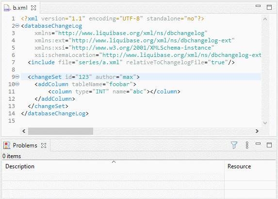

# Liquibase XML Editing Support

_Want to provide some powerful Liquibase XML editing support?_

This project is an [Eclipse LemMinX](https://github.com/eclipse/lemminx) (XML Language Server) extension to provide some extra assistance to edition of Liquibase XML files

## Features

Additionally to the XSD based assistance provided by LemMinX when editing pom files, this extension adds:

- Liquibase parsing error reports and diagnostics
- SQL parsing diagnostics (using embedded H2 DB)
- completion for `id`

Here a demo in Eclipse IDE:



## Integrations

### Eclipse IDE

A packaged update-site can be found among the release artifacts.

### VSCode

See also [#6](/../../issues/6)

## Developer

This project is written with JDK 14, but compiled for JRE 8, using [Jabel](https://github.com/bsideup/jabel).

## Getting Started

```Bash
mvn clean package -Dfor-target-jre8
```